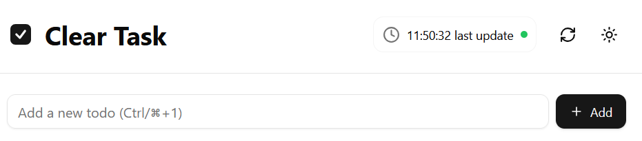
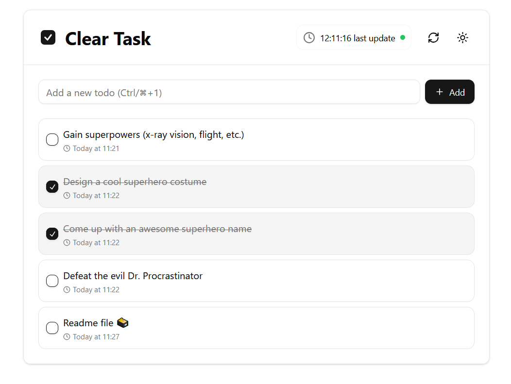
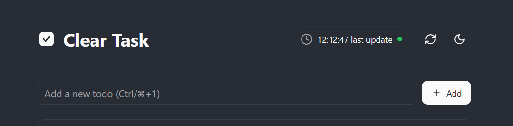

# 📝 Notion inspired TODO with Notion integration

A sleek and modern todo application built with React, TypeScript, and Vite, featuring a beautiful UI powered by Radix UI components.

## Table of Contents
- [Features](#-features)
- [Tech Stack](#-tech-stack)
- [Getting Started](#️-getting-started)
- [Setup Notion Integration](#-setup-notion-integration)
- [Vercel Deployment](#-vercel-deployment)
- [Available Scripts](#-available-scripts)
- [Project Structure](#️-project-structure)
- [API Endpoints](#-api-endpoints)
- [UI Showcase](#-ui-showcase)
- [License](#-license)
- [Contribution](#-contribution)
- [Contact](#-contact)

---

 

## ✨ Features

- 🚀 **Modern Stack**: React (v18) with TypeScript
- 💎 **Beautiful UI**: Radix UI primitives for polished and accessible components
- 📱 **Responsive Design**: Tailwind CSS for adaptive styling
- 📖 **Notion API Integration**: Seamless data synchronization with Notion
- 🎨 **Theming**: Switch between light and dark themes with ease
---

## 🚀 Tech Stack

| Frontend         | Backend          | Styling         | Other         |
|-------------------|------------------|-----------------|---------------|
| React 18         | Express.js       | Tailwind CSS    | Notion API    |
| TypeScript       |         Vercel deploy         | Radix UI        | react-hook-form |
| Vite             |                  | next-themes     |               |

---

## 🛠️ Getting Started

Follow these steps to get the project running on your local machine:

1. **Clone the repository**:
   ```bash
   git clone https://github.com/ruslanlap/NotionTODO.git
   cd NotionTODO
   ```

2. **Setup Environment Variables**:
   Rename `.env.example` to `.env` or create `.env` and fill in the required credentials:
   ```env
   YOUR_PAGE_ID=your_notion_page_id
   NOTION_API_KEY=your_notion_api_key
   ```

4. **Install Dependencies**:
   ```bash
   npm install
   ```

5. **Run the Development Server**:
   ```bash
   npm run dev
   ```

6. **Access the app**:
   Open [http://localhost:5173](http://localhost:5173) in your browser.

---
## 🔑 Setup Notion Integration

1. **Create a Notion Integration**
   - Go to [Notion Developers](https://www.notion.so/my-integrations)
   - Click "New integration"
   - Give your integration a name (e.g., "Todo App")
   - Select the workspace where you want to use the integration
   - Click "Submit" to create your integration
   - Save the "Internal Integration Token" (it starts with `ntn_`)

2. **Create a Notion Page**
   - Create a new page in Notion where you want to store your todos
   - Click the ⋮⋮⋮ menu at the top right of your page
   - Go to "Add connections" and find your integration
   - Click "Confirm" to give your integration access to the page
   - Copy the page ID from the URL:
     ```
     https://www.notion.so/Your-Page-Title-{PAGE_ID}?v=...
     ```
     The PAGE_ID is a 32-character string after your page title

---

## 🚀 Vercel Deployment

Follow these steps to deploy your application to Vercel:

1. **Prepare for Deployment**
   - Make sure your project is pushed to a GitHub repository
   - Ensure all environment variables are properly set up in your `.env` file

2. **Deploy to Vercel**
   - Go to [Vercel](https://vercel.com) and sign in with your GitHub account
   - Click "New Project"
   - Import your GitHub repository
   - Configure your build settings:
     ```
     Build Command: npm run build
     Output Directory: dist
     Install Command: npm install
     ```

3. **Environment Variables**
   - In your Vercel project settings, go to the "Environment Variables" tab
   - Add your environment variables:
     ```
     YOUR_PAGE_ID=your_notion_page_id
     NOTION_API_KEY=your_notion_api_key
     ```

4. **Deploy**
   - Click "Deploy"
   - Vercel will automatically build and deploy your application
   - Once complete, you'll receive a deployment URL

5. **Custom Domain (Optional)**
   - In your project settings, go to "Domains"
   - Add your custom domain
   - Follow Vercel's instructions to configure your DNS settings

6. **Automatic Deployments**
   - Vercel will automatically deploy updates when you push to your main branch
   - You can configure branch deployments in your project settings

---

## 🔧 Available Scripts

- `npm run dev`: Start the development server
- `npm run build`: Build the app for production
- `npm run preview`: Preview the production build
- `npm run lint`: Run the linter to check for code quality issues

---

## 🏗️ Project Structure

```
├── api/
│   └── notion/
│       ├── createTodo.ts
│       ├── deleteTodo.ts
│       ├── fetchTodos.ts
│       └── updateTodo.ts
├── src/
│   ├── components/
│   │   └── Todo/
│   │       ├── TodoList.tsx
│   │       └── TodoItem.tsx
│   ├── hooks/
│   │   └── // Custom React hooks
│   ├── lib/
│   │   ├── config.ts
│   │   ├── middleware.ts
│   │   ├── notion.ts
│   │   └── utils.ts
│   ├── App.css
│   ├── App.tsx
│   ├── index.css
│   ├── main.tsx
│   └── vite-env.d.ts
├── dist/
│   └── // Build output directory
├── .env                    # Development environment variables
├── package.json
├── tsconfig.json
├── vite.config.ts
└── README.md
```

## 🔌 API Endpoints

The application provides the following API endpoints:

```typescript
GET    /api/notion/blocks          // Fetch all todos
PATCH  /api/notion/blocks         // Create new todo
PATCH  /api/notion/blocks/:id    // Update existing todo
DELETE /api/notion/blocks/:id    // Delete todo
```

---

## 🎨 UI Showcase

Take a look at some of the beautiful UI components included in the project:

### 📌 Todo Management



### 🎨 Theme Support

---

## 📄 License

This project is licensed under the [MIT License](./LICENSE).

---

## 🤝 Contribution

Contributions are welcome! Follow these steps to contribute:

1. Fork the repository
2. Create a new branch (`feature/new-feature`)
3. Commit your changes (`git commit -m "Add new feature"`)
4. Push to the branch (`git push origin feature/new-feature`)
5. Open a Pull Request

---

## 📬 Contact

Have questions or suggestions? Reach out!

- **GitHub**: [@ruslanlap](https://github.com/ruslanlap)
- **Telegram**: [ruslan](https://t.me/ruslan_ls)

---